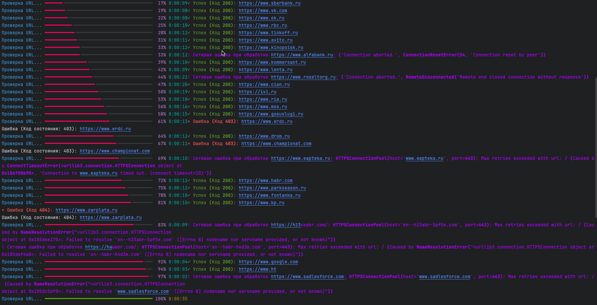
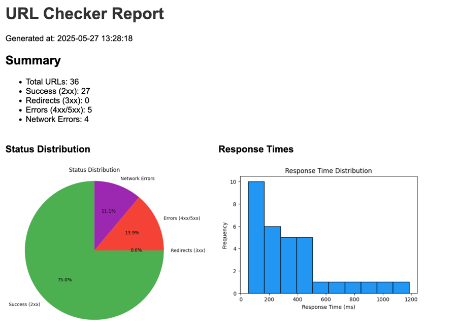
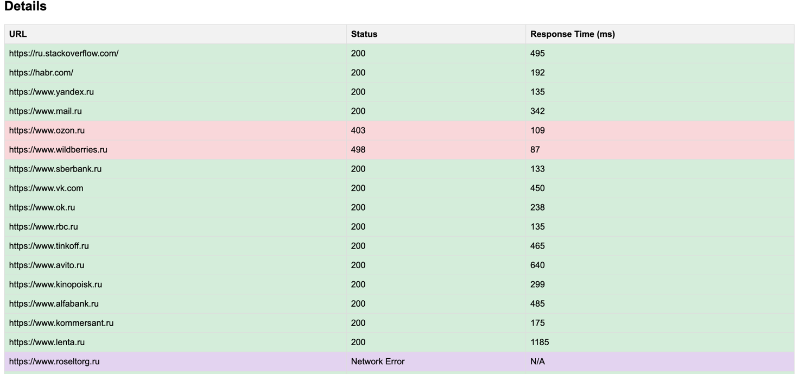

# check-urls


Этот проект предоставляет утилиту для проверки URL-адресов из файла и записи успешных URL-адресов в выходной файл. Утилита поддерживает передачу заголовков, нормализацию URL и обработку перенаправлений.

## Основные функции

- **Проверка доступности URL-адресов**: Проверяет доступность URL-адресов из входного файла.
- **Нормализация URL**: Автоматически добавляет `https://www.` к URL-адресам, если это необходимо.
- **Поддержка заголовков**: Позволяет передавать пользовательские заголовки для HTTP-запросов.
- **Обработка перенаправлений**: Автоматически обрабатывает перенаправления (редиректы) и проверяет конечный URL.
- **Запись результатов**: Сохраняет успешные URL-адреса в выходной файл.
- **Цветной отчет в консоли:** 
  - Успех (2xx) – зелёный 
  - Редиректы (3xx) – жёлтый  
  - Ошибки (4xx, 5xx) – красный 
  - Сетевые ошибки – фиолетовый

- **HTML отчет с диаграммой и гистограммой для более удобного анализа полученных данных**:
  - 
  - 

## Структура проекта
```
check_urls/
│── cli.py          # CLI-команда для запуска проверки
│── core.py         # Основная логика обработки URL
│── http_client.py  # HTTP-клиент на основе requests
│── status_handler.py # Обработчик статусов HTTP
│── __main__.py     # Точка входа в программу
│── requirements.txt # Список зависимостей
│── README.md       # Документация
```

## Возможности

- Проверка списка URL-адресов на доступность с использованием `requests`.
- Обработка HTTP-статусов:
  - **Успешные (2xx)**: Запись URL в файл.
  - **Редиректы (3xx)**: Переход по новому адресу и проверка доступности.
  - **Ошибки (4xx, 5xx)**: Логирование ошибки.
- Ввод и вывод файлов задаются через аргументы командной строки.
- HTML отчет о проделанной работе
## Установка

### 1. Клонирование репозитория

```bash
git clone https://github.com/panisimov812/PythonProject.git
cd check-urls
```

## Создание виртуального окружения
```
python -m venv venv
source venv/bin/activate  # Для Linux/macOS
venv\Scripts\activate     # Для Windows
```
## Установка зависимостей
```
pip install -r requirements.txt
```

## Запуск
```
Пример c хедером
python -m check_urls.cli --input input.txt --output output.txt --header "Authorization: Bearer token"

Пример без хедера
python -m check_urls.cli --input urls.txt --output successful_urls.txt

Пример запуска с созданием html отчета
python -m check_urls.cli --input input.txt --output output.txt --report report.html
```